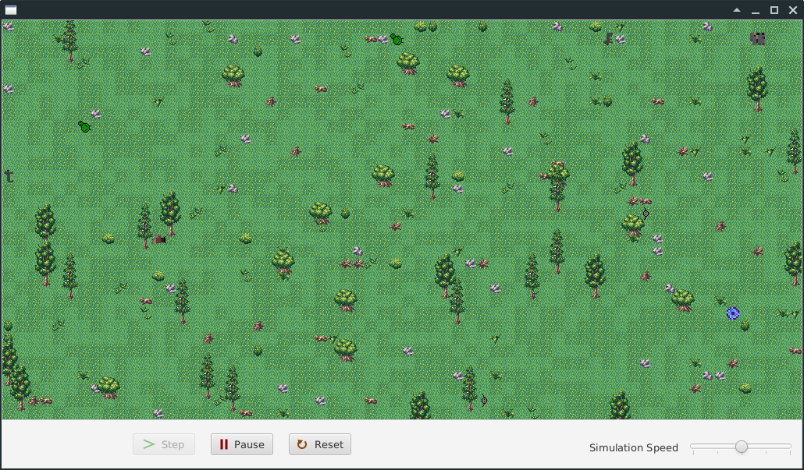

# Soultraps: Greenfoot RPG 

## About

Soultraps is a 2D RPG made with Greenfoot. 

### Levels

- A single level consists of 128x128 tiles of 16x16px.
- In each level is a portal to another (the "next" as there is no way back) level.
- The level is randomly generated each time the player enters a portal
- The items collected in each level are saved throughout the game
- Every level contains a savepoint (this also persists the level)
- When restarting the game after saving, a "Load Game" button will appear
    
### Controls

- Walk
    - Up `w`
    - Left `a`
    - Down `s`
    - Right `d`
- Interact
    - Start conversation `e` (only for friendly mobs)
    - Next Message `space`

## Third Party Stuff

- Skyrim Font by [DarkX ShadowX21](https://www.dafont.com/de/darkx-shadowx21.d5582)
- Daedra Font by [Levi Webster](https://www.dafont.com/de/levi-webster.d7357)
- Forest Tiles by [surt](https://opengameart.org/users/surt)