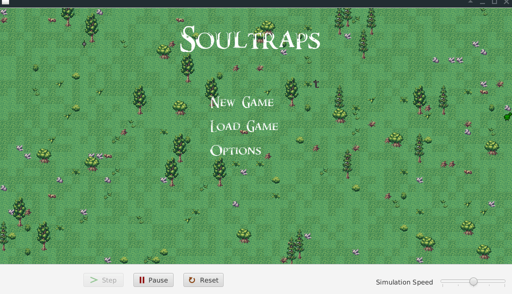

# Soultraps: Greenfoot RPG 

## About

Soultraps is a 2D RPG made with Greenfoot. 

### Story

You are a magician exploring a strange world where planes of existence are connected by portals. You meet an alchemist (among other people) who is in search of the legendary golden potion. 

You also discover that some portals are sending you to strange, hellish places with castles in them. Unfortunately you are not able to step through the flames that appear whenever you get too close to them.

Maybe the inhabitants of the world you are exploring can be of some help?  

### Mechanics

- A single level consists of 128x128 tiles of 16x16px.
- In each level is a portal to another (the "next" as there is no way back) level.
- The level is randomly generated each time the player enters a portal
- The items collected in each level are saved throughout the game
- Every level contains a savepoint (this also persists the level)
- When restarting the game after saving, a "Load Game" button will appear
- Possible directions are: up, down, left, right

### Controls

- Walk
    - Up `w`
    - Left `a`
    - Down `s`
    - Right `d`
- Attack
    - Up `↑`
    - Left `←`
    - Down `↓`
    - Right `→` 
- Interact
    - Start conversation `f` (only for friendly mobs)
    - Next message `space`
    - Use item selected in HUD `r`
    - Drop item selected in HUD `t`
    - Change item selected in HUD `q`/`e`

## Third Party Stuff

- Skyrim Font by [DarkX ShadowX21](https://www.dafont.com/de/darkx-shadowx21.d5582)
- Daedra Font by [Levi Webster](https://www.dafont.com/de/levi-webster.d7357)
- Forest Tiles by [surt](https://opengameart.org/users/surt)